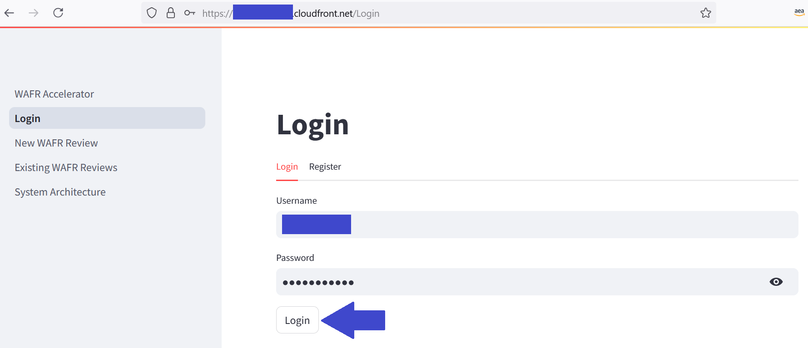

# Streamlit Frontend UI Application

## Introduction

This application is a simple UI for the AWS WAFR application. The application is deployed in Amazon ECS, AWS Fargate. There is one Application Load Balancer associated with it.

## Component Details

#### Prerequisites

- All resources defined in the code stack deployed successfully

#### Technology stack

- [Amazon ECS](https://aws.amazon.com/ecs/)
- [Application Load Balancer](https://aws.amazon.com/elasticloadbalancing/application-load-balancer/)

### Run Locally

```bash
streamlit run app.py --server.runOnSave true --server.port 8501
```

### User Interface


